# Лабораторная работа

Министерство науки и высшего образования Российской Федерации Федеральное государственное бюджетное образовательное учреждение высшего образования Уфимский университет науки и технологий

Кафедра АСУ

Отчет по лабораторной работе №3 по дисциплине «Основы современных цифровых технологий и искусственного интеллекта» на тему «Диаграмма как код»

Выполнил: ст. гр. ИВТ-ИСУ-102б Ахмадишин А.А.

Уфа-2024

**Задание 1:** Создал файл в репозиториq гитхаб

**Задание 2:**
Алгоритм — это набор инструкций для достижения цели, используемый в программировании, математике и повседневной жизни.
Слово "алгоритм" происходит от имени арабского математика Мухаммеда ибн Мусы аль-Хорезми. Его работы по математике в IX веке стали основой для алгоритмических методов. В латинских переводах его трудов термин "algoritmi" обозначал описанные им методы, что привело к современному слову "алгоритм".

**Задание 3:**
В статье на Википедии про блок-схемы рассказывается о том, как их используют для представления алгоритмов и процессов. Стандартные обозначения блоков это: "Старт/Финиш", "Операции", "Петли", "Разделение" и "Слияние". Эти обозначения помогают визуализировать процесс и делают его понятнее.

**Задание 4:**
Воспользовавшись нейросетью от Сбера "GigaChat" я выснил, что информация о переходе от термина "блок-схемы алгоритмов" к "схемы алгоритмов" может быть труднодоступной, так как этот процесс происходил постепенно и неофициально. Блок-схемы начали использоваться в середине XX века для визуализации алгоритмов и процессов, часто называясь "диаграммами потоков данных". Со временем, с развитием технологий, термин "блок-схема" стал менее актуальным, и люди стали использовать более общий термин "схемы алгоритмов", акцентируя внимание на визуальном представлении.

**Задание 5**
ОСТ 19.701-90 — это стандарт, касающийся схем алгоритмов, программ, данных и систем, а также условных обозначений и правил их оформления. Он был введён в действие с 1 января 1992 года и соответствует международному стандарту ISO 5807:1985. Данный стандарт определяет символы для представления схем алгоритмов и программ, а также устанавливает правила их использования при отображении различных задач обработки данных и методов их решения. Стандарт является обязательным для применения и не охватывает форму записей внутри символов, которые уточняют их функции.
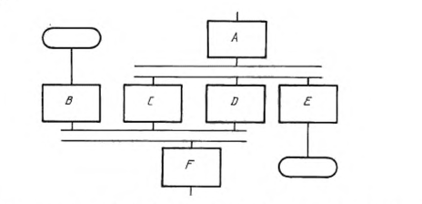

**Задание 6**
Использовав нейросеть от Сбера "GigaChat" я выснил, что Workflow diagram (диаграмма рабочего процесса) и Flowchart (блок-схема алгоритма) часто используются вместе для описания последовательности действий или бизнес-процессов. Workflow diagram обычно включает в себя блоки, представляющие различные этапы процесса, и линии, которые показывают, как данные или задачи перемещаются между этими этапами. Блок-схема алгоритма Flowchart использует аналогичные символы и линии для иллюстрации алгоритмических процессов, таких как выполнение программы или решения задачи. Таким образом, хотя оба термина описывают визуальные представления процессов, они могут быть использованы в разных контекстах и для разных целей.

**Задание 7:**
Создал пустую диаграмму на сервисе Draw.io
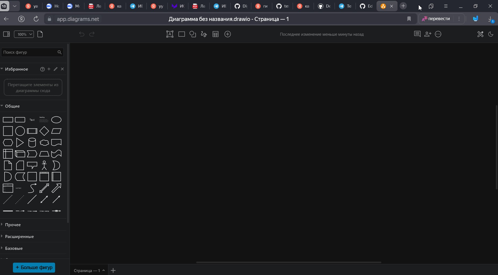

**Задание 8:**
Слово "терминатор" происходит от латинского terminare, что означает "заканчивать". В общем смысле это тот, кто завершает или уничтожает что-либо.
В программировании "терминатор" обозначает начальные и конечные точки в блок-схемах. Эти символы (обычно овалы) представляют начало и конец алгоритма.
В контексте научной фантастики и кино, это слово часто используется для обозначения персонажей или механизмов, которые выполняют функции уничтожения.

**Задание 9:**
В сервисе Draw.io я построил схему алгоритма, состоящую из трёх блоков, как показано на рисунке.
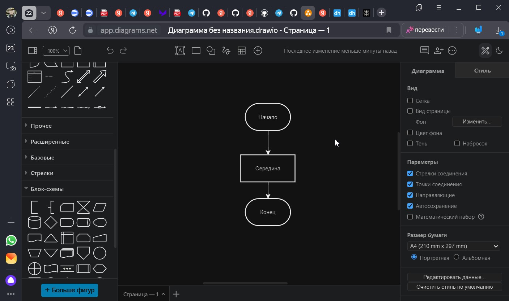

**Задание 10:**

Я сохранил блок схему во всех четырёх форматах и вот что выяснил:

 * XML- Открывается в текстовом редакторе для просмотра структуры данных.
 * PNG - Открывается в графическом редакторе. Является растовым форматом и теряет качество при увеличении
 * SVG - также открывается в графическом редакторе. Является векторный, что позволяет увеличивать изображение без потери качества.
 * HTML- Открывается в браузере для просмотра.

**Задание 11:**

Для вставки в документы типа DOCX нужно:

    1 Cохранить схему в формате PNG
    2 Откыть документ в Microsoft Word.
    3 Перейти в меню Вставка.
    4 Выбрать Рисунок и найти файл изображения на вашем компьютере.
    5 Выберать изображение и нажать Вставить.

Для вставки в документы типа MD нужно:

Для вставки локального изображения можно использовать следующий синтаксис:
Markdown
  >

**Задание 16:**

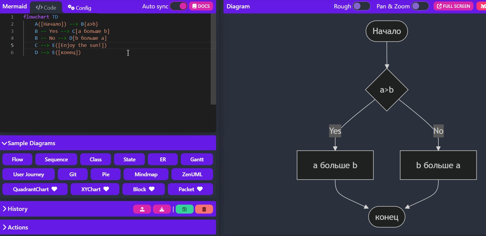

**Задание 17:**

Воспользовавшись нейросетью Perplexity я узнал о технологиях:

1. Base64 - это схема кодирования, которая преобразует двоичные данные в ASCII-текст. Широко используется для передачи данных по электронной почте и в веб-приложениях.

2. IPython - это улучшенная интерактивная оболочка Python с функциями динамической интроспекции и поддержкой визуализации данных.

3. Jupyter Notebook - это веб-приложение для создания и обмена документами с живым кодом, уравнениями и визуализациями. Поддерживает несколько языков программирования.

4. Pyplot - модуль Matplotlib, предоставляющий интерфейс для создания графиков в стиле MATLAB с минимальным количеством кода.

5. Matplotlib - библиотека для создания статических и интерактивных визуализаций в Python, интегрированная с NumPy.

6. UTF-8 - кодировка символов, способная кодировать все возможные символы Unicode, широко используемая в интернете.

7. URL - (Uniform Resource Locator) — адрес для доступа к ресурсам в интернете, указывающий их местоположение и протокол.

8. ASCII - стандарт кодирования символов для электронной связи, представляющий 128 символов в виде семиразрядных целых чисел.

9. Параметры - это переменные в определении функции, а аргументы — реальные значения, передаваемые при вызове функции.

10. Строка - это последовательность символов, представляющая текст в программировании.

11. Многострочная строка позволяет создавать строки, занимающие несколько строк без использования специальных символов, с помощью тройных кавычек (''' или """).

**Задание 18:**Пример кода успешно сработал, и я получил визуализацию диаграммы. 

**Задание 19:**
Посмотрев статью на википедии я выяснил, что основная идея Base64 заключается в том, что он позволяет передавать бинарные данные через текстовые протоколы, такие как электронная почта. Это важно, так как некоторые системы могут не поддерживать 8-битные данные. Число 64 указывает на количество уникальных символов в алфавите Base64. Эти символы включают: 26 заглавных букв: A-Z, 26 строчных букв: a-z, 10 цифр: 0-9, 2 специальных символа: + и /. Общее количество символов составляет 64, что также является степенью двойки 2^6. Каждый символ представляет собой 6 бит информации.

**Задание 20:**
Я вставил пример кода для блок-схемы, который корректно отобразился после нажатия "Render". Далее я изучил возможность экспорта диаграммы в форматах PNG и SVG. Изменив элементы в коде, я убедился в интерактивности платформы, так как диаграмма обновилась мгновенно.

**Задание 20:**Использовав нейросеть от Perpltxity я выснил, что название Mermaid (русалочка) отражает функциональность и эстетическую привлекательность инструмента. Слово состоит из "mer" (море) и "maid" (девушка), что вызывает образы красоты и элегантности. Разработчики выбрали название для создания ассоциаций с креативностью и удобством. "Mermaid" воплощает сочетание красоты, гибкости и функциональности, что делает его мощным инструментом для визуальной коммуникации.

**Задание 21**

Задание: Я посмотрел статью на Википедии о Mind Map, в которой описывается техника визуализации, помогающая организовать идеи и ассоциации. Она используется для мозгового штурма, планирования и анализа данных. Примеры показывают, как применять эту технику: структура книги с главами как ветвями и план путешествия с пунктами назначения, транспортом и жильем.

**Задание 22:**
Я посмотрел статью на Википедии о PlantUML, которая описывает эту технологию для создания UML-диаграмм и других видов диаграмм с использованием простого языка разметки. PlantUML поддерживается различными программами и инструментами, включая плагины для редакторов кода, такие как IntelliJ IDEA, Eclipse и Visual Studio Code, а также онлайн-сервисы, такие как draw.io и PlantText. Эти инструменты позволяют пользователям создавать и редактировать диаграммы прямо в среде разработки или через веб-интерфейс.

**Задание 23:** На странице проекта PlantUML на GitHub я заметил зеленый листочек рядом с названием. Этот значок указывает на активное развитие проекта и его поддержку, что свидетельствует о его актуальности и функциональности.

**Задание 24:** Mind maps - это мощный инструмент для визуализации и организации информации, используемый в образовании, бизнесе, личном развитии и творчестве. В образовании они помогают студентам создавать конспекты и готовиться к экзаменам, в бизнесе - стратегически планировать и управлять проектами, в личном развитии - ставить цели и приоритезировать задачи, а также в творчестве - генерировать идеи и решать проблемы.

**Задание 25:**
Я обратился к нейросети  Perplexity он сгенереировал такой промт "Ты — карьерный консультант, который помогает людям определить подходящую профессию на основе их интересов, навыков и целей. Пожалуйста, задай мне несколько вопросов о моих предпочтениях, опыте и жизненных целях, чтобы помочь мне выбрать подходящую профессию. Учитывай такие аспекты, как мои сильные стороны, интересы и желаемый уровень заработка. В конце консультации порекомендуй мне конкретную профессию и объясни, почему она подходит именно мне.". Создав новое диалоговое окно я ввёл этот промт. В результате консультации чат-бот порекомендовал мне профессию **backend-разработчика**

**Задание 26:**
Прочитав статью я выснил, что history graph - графическое представление истории версий программного проекта. Этот граф показывает, как различные версии кода развивались со временем. Структура графа обычно древовидная или направленная ациклическая, где каждый узел представляет версию, а ребра - изменения между ними. Если работают с несколькими ветками, граф показывает, как изменения объединяются в основную ветку. History graph облегчает анализ и отладку кода, показывая, кто и когда внес изменения. Инструменты для визуализации включают Git и другие системы контроля версий.

**Задание 27:**
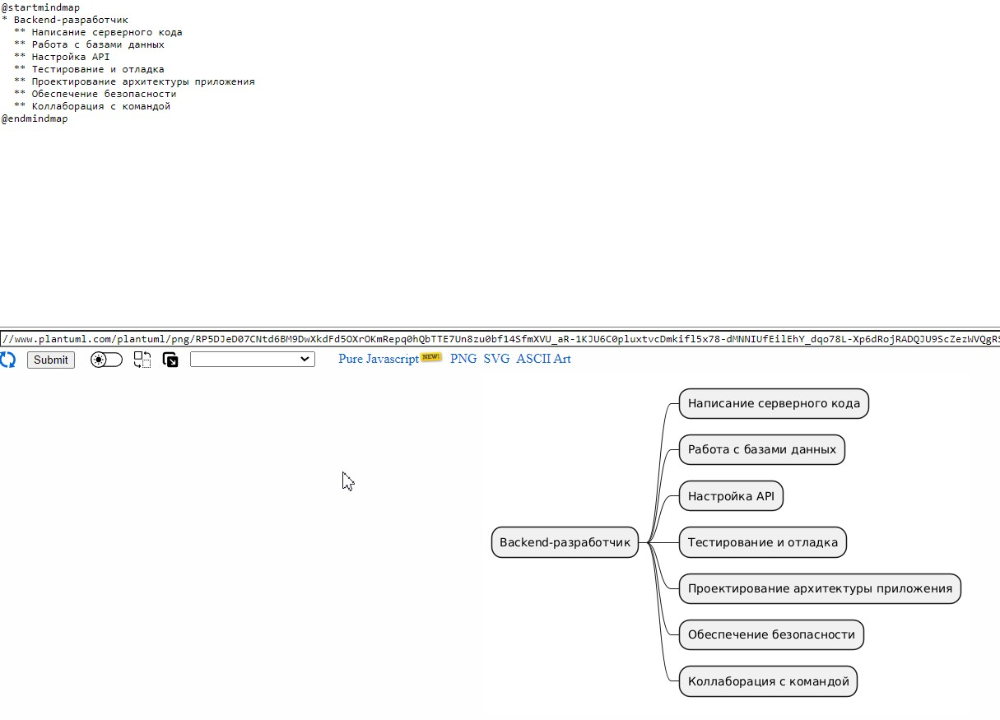

**Задание 28:**
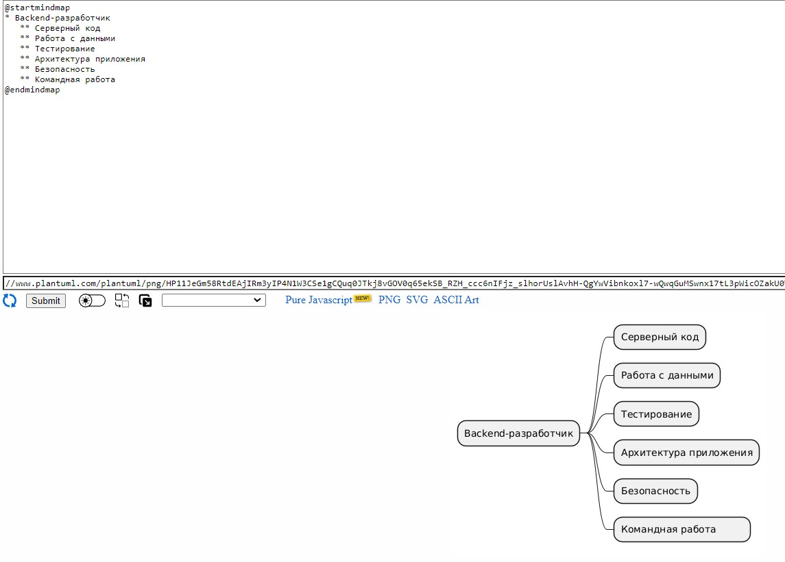

**Задание 29:**
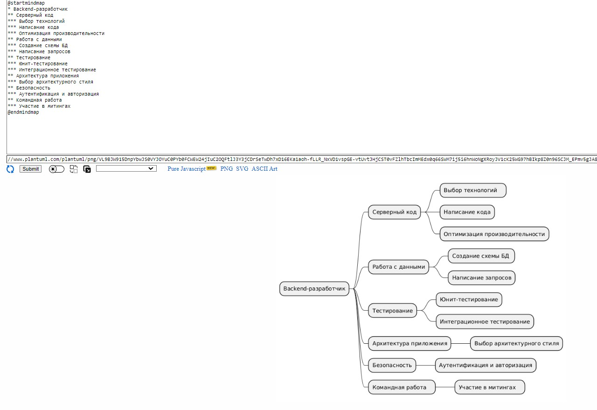

**Задание 30:**
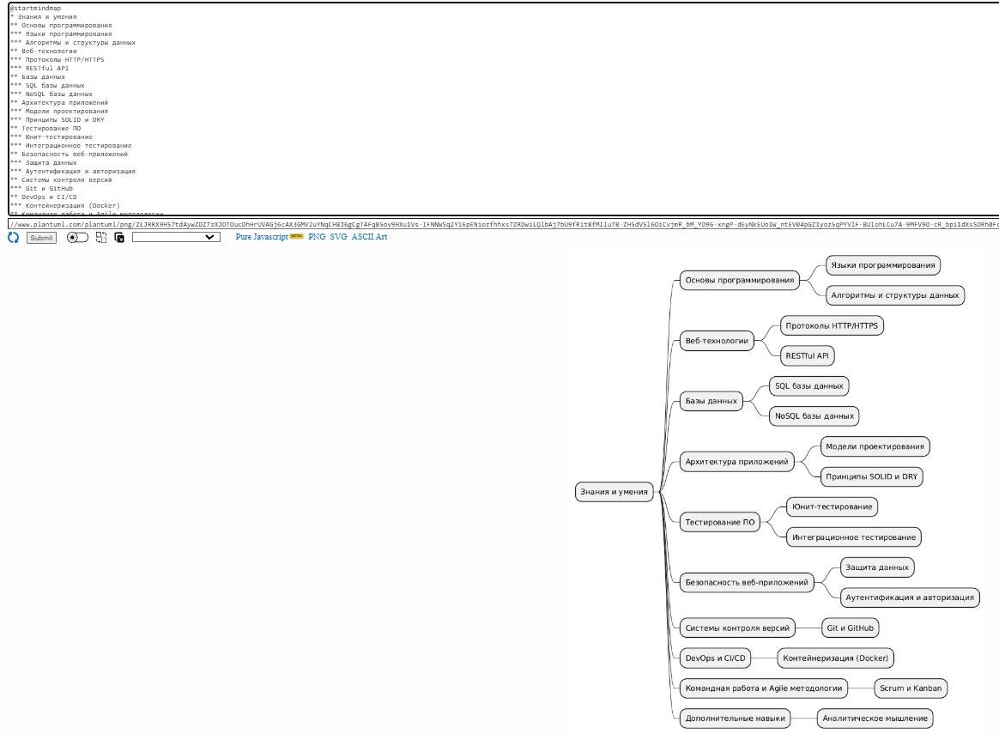

**Задание 31:**
Текст программы:

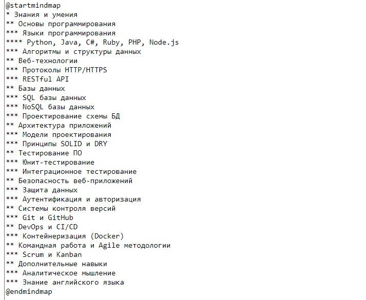

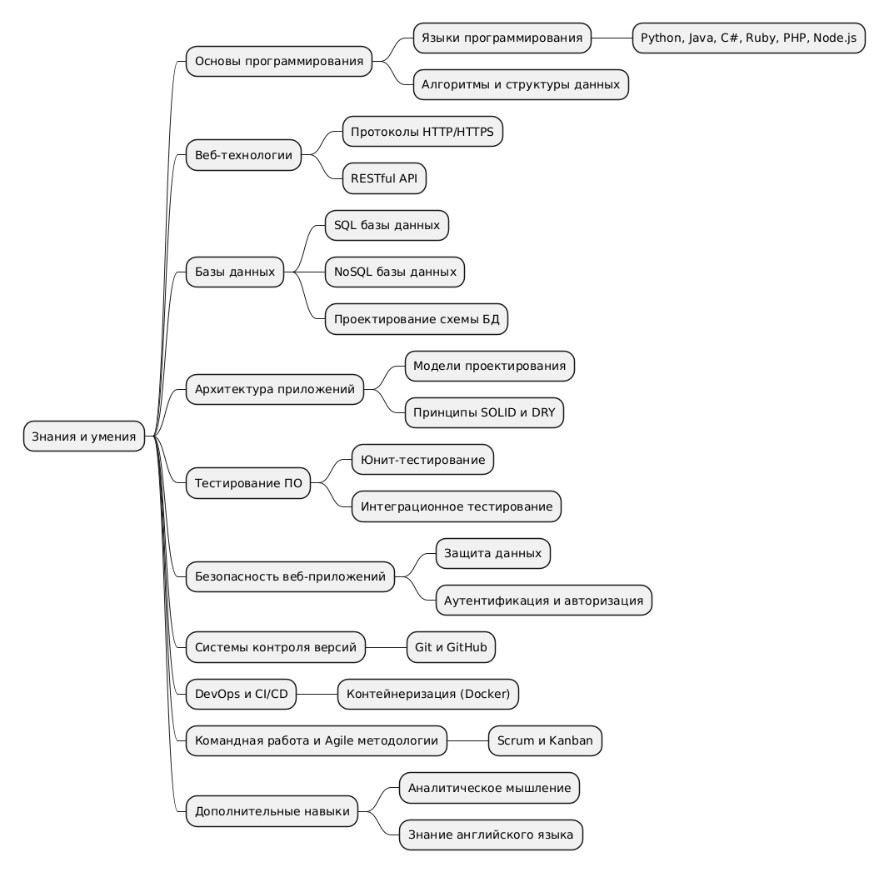

**Задание 32:**
Текст программы:

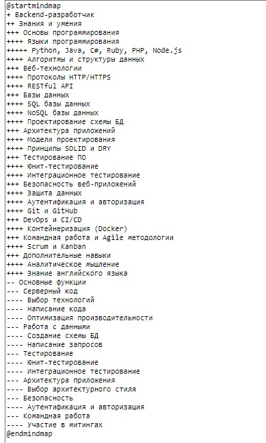

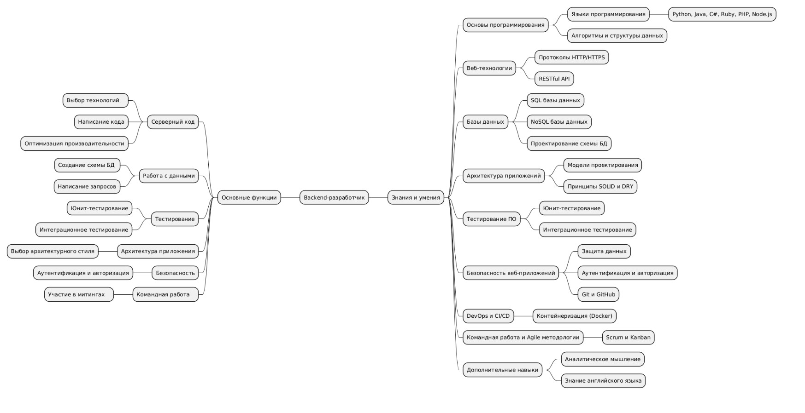

**Задание 33:**
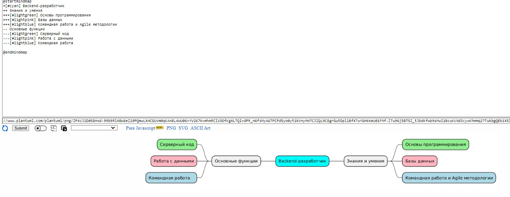

**Задание 34:**
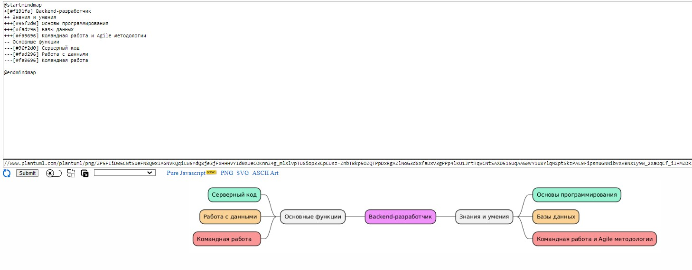

**Задание 35:**

Yandex Wiki - это бесплатный инструмент для создания базы знаний.

**Задание 36:**

Прочитав статью я выяснил, что название "Википедия" образовано от слов "wiki" и "encyclopedia". "Wiki" пришло из гавайского "wikiwiki", что значит "быстрый", и было популяризировано Уордом Каннингемом в 1995 году. Ларри Сэнгер предложил добавить "encyclopedia", чтобы подчеркнуть скорость и доступность платформы.

**Задание 37:**
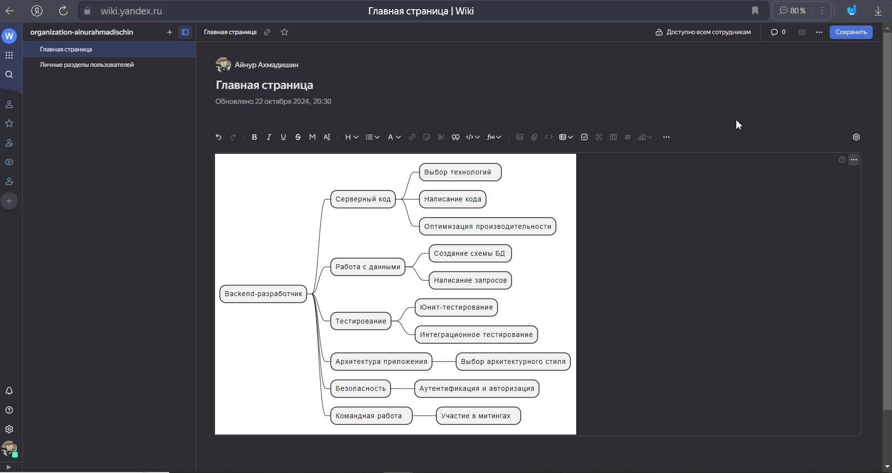

**Задание 38:**

Прочитав стать на википедии я выяснил, что WYSIWYG расшифровывается как "What You See Is What You Get", что означает "что видишь, то и получаешь". Это концепция в ПО, где редактируемый контент выглядит так же, как конечный результат.

**Задание 39:**

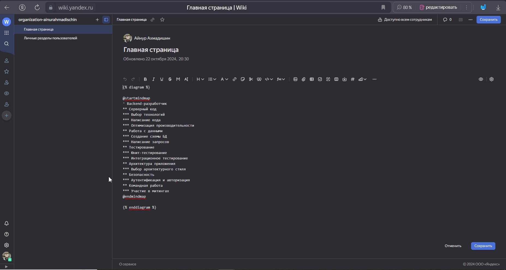

**Задание 40**

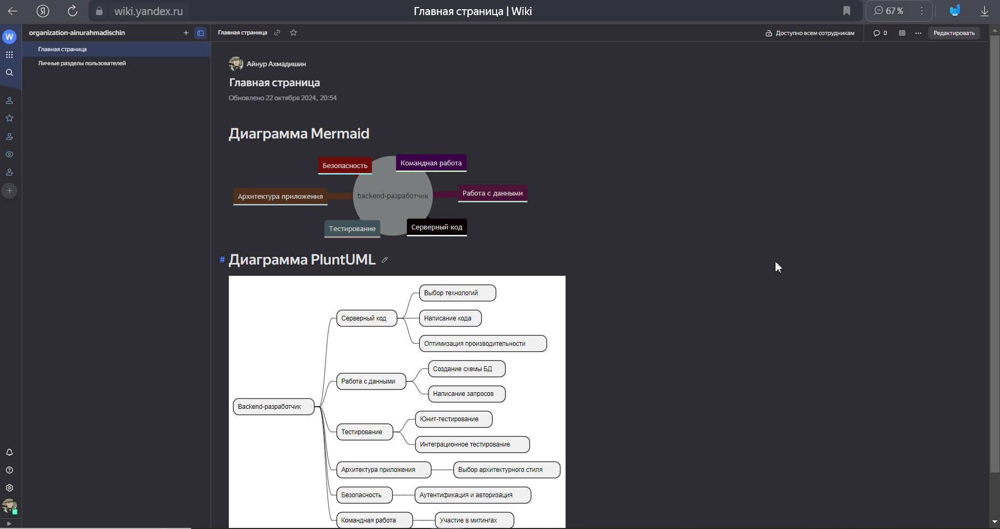
Сделав запрос к нейросети Perplaxity я получил ответ:
Чтобы запустить PlantUML сервер с помощью Docker, вы можете использовать следующие команды. Они отличаются последним параметром, который определяет веб-сервер: **jetty** или **tomcat**.

### Команды для запуска

1. **С использованием Jetty**:
   ```bash
   docker run -d -p 8080:8080 plantuml/plantuml-server:jetty
   ```

2. **С использованием Tomcat**:
   ```bash
   docker run -d -p 8080:8080 plantuml/plantuml-server:tomcat
   ```

### Объяснение параметров команд

- **docker run**: Команда для запуска нового контейнера.
- **-d**: Запуск контейнера в фоновом режиме (detached mode).
- **-p 8080:8080**: Проброс порта. Первый 8080 — это порт на вашем хосте, второй 8080 — порт внутри контейнера. Это позволяет вам получать доступ к серверу через `http://localhost:8080`.
- **plantuml/plantuml-server:jetty** или **plantuml/plantuml-server:tomcat**: Указывает образ, который будет использоваться для создания контейнера. Здесь `jetty` и `tomcat` — это разные реализации веб-сервера, которые могут обрабатывать запросы.

### Jetty vs Tomcat

- **Jetty**: Легковесный и быстрый веб-сервер, который часто используется для разработки и тестирования. Он хорошо подходит для приложений, которые требуют высокой производительности и низкой задержки.
  
- **Tomcat**: Более мощный и функциональный сервер приложений, который поддерживает более широкий набор возможностей Java EE. Он может быть предпочтительным выбором для более сложных приложений.

Выбор между Jetty и Tomcat зависит от ваших потребностей в производительности и функциональности.

Задание: 
Чтобы настроить сервер PlantUML с использованием Docker, я запустил контейнер. Затем я создал файл diagram.puml с кодом для диаграммы, например, с запросом и ответом аутентификации. После этого я открыл браузер и перешёл по адресу http://localhost:8080/plantuml, чтобы вставить код и сгенерировать диаграмму. Для изменения диаграммы я обновил код, добавил цвет к блокам, например, изменяя цвет заметки на светло-голубой. Наконец, я исследовал различные настройки и варианты просмотра, чтобы настроить отображение диаграммы по своему усмотрению.

